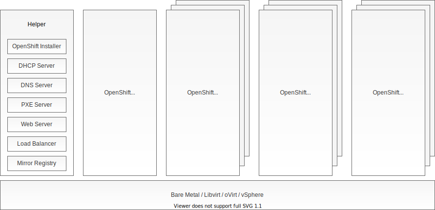

# OpenShift Automated User-Provided Infrastructure

Preparing infrastructure for OpenShift 4 installation by hand is a rather tedious job. In order to save the effort, *openshift-auto-upi* provides a set of Ansible scripts that automate the infrastructure creation.

*openshift-auto-upi* is a separate tool, and is not in any way part of the OpenShift product. It enhances the *openshift-installer* by including automation for the following:

*openshift-auto-upi* comes with Ansible roles to provision OpenShift cluster hosts on vSphere platforms.


# Deployment Overview



* **Helper host** is a (virtual) machine that you must provide. It is a helper machine from which you will run *openshift-auto-upi* Ansible scripts. 
  * It is stronly discouraged to use *openshift-auto-upi* to provision infrastructure components on a bastion host. Services provisioned by *openshift-auto-upi* are not meant to be exposed to the public Internet.
  
* **OpenShift hosts** will be provisioned for you by *openshift-auto-upi* unless your target platform is bare metal.

## Networking

### Using Static IPs

If you prefer configuring your OpenShift hosts using static IPs as opposed to leveraging the DHCP provisioning, *openshift-auto-upi* allows you to do that. While you are configuring *openshift-auto-upi* (detailed information in the following sections), perform these steps:

After cloning the *openshift-auto-upi* git repository,

Add your network configuration (gateway, netmask, name servers) to the *boot_iso* section of the *openshift_install_config.yml* file:

```
$ cp inventory/group_vars/all/openshift_install_config.yml.sample \
    inventory/group_vars/all/openshift_install_config.yml
$ vi inventory/group_vars/all/openshift_install_config.yml
```

You are all set! *openshift-auto-upi* will configure your OpenShift nodes using static IPs.

For further information on the Static IPs feature, you can refer to [OpenShift UPI using static IPs](https://www.openshift.com/blog/openshift-upi-using-static-ips).

## Platform-Specific Documentation


Before continuing with the next steps, make sure that you applied the [OS-specific configuration instructions](docs/os_specific_config.md).

```
$ yum install git
$ yum install ansible
```
Clone the *openshift-auto-upi* repo to your Helper host and check out a tagged release. I recommend that you use a tagged release which receives more testing than master:

```
$ git clone https://github.com/jsubbiah/openshift-auto-upi.git
$ cd openshift-auto-upi
```

## Creating Mirror Registry

If you are installing OpenShift in a restricted network, you will need to create a local mirror registry. This registry will contain all OpenShift container images required for the installation. *openshift-auto-upi* automates the creation of the mirror registry by implementing the steps described in the [Creating a mirror registry](https://docs.openshift.com/container-platform/latest/installing/install_config/installing-restricted-networks-preparations.html). To set up a mirror registry:

```
$ cp inventory/group_vars/all/infra/mirror_registry.yml.sample \
    inventory/group_vars/all/infra/mirror_registry.yml
$ vi inventory/group_vars/all/infra/mirror_registry.yml
```

```
$ ansible-playbook mirror_registry.yml
```

## Preparing for OpenShift Installation

Create custom *openshift_install_config.yml* configuration:

```
$ cp inventory/group_vars/all/openshift_install_config.yml.sample \
    inventory/group_vars/all/openshift_install_config.yml
$ vi inventory/group_vars/all/openshift_install_config.yml
```

Create custom *openshift_cluster_hosts.yml* configuration:

```
$ cp inventory/group_vars/all/openshift_cluster_hosts.yml.sample \
    inventory/group_vars/all/openshift_cluster_hosts.yml
$ vi inventory/group_vars/all/openshift_cluster_hosts.yml
```

Download OpenShift clients using Ansible:

```
$ ansible-playbook clients.yml
```

## Installing DHCP Server

Note that *dnsmasq.yml* configuration file is shared between the DHCP, DNS, and PXE servers.

```
$ cp inventory/group_vars/all/infra/dnsmasq.yml.sample inventory/group_vars/all/infra/dnsmasq.yml
$ vi inventory/group_vars/all/infra/dnsmasq.yml
```

```
$ cp inventory/group_vars/all/infra/dhcp_server.yml.sample inventory/group_vars/all/infra/dhcp_server.yml
$ vi inventory/group_vars/all/infra/dhcp_server.yml
```

Provision DHCP server on the Helper host using Ansible:

```
$ ansible-playbook dhcp_server.yml
```

## Installing DNS Server

Note that *dnsmasq.yml* configuration file is shared between the DHCP, DNS, and PXE servers.

```
$ cp inventory/group_vars/all/infra/dnsmasq.yml.sample inventory/group_vars/all/infra/dnsmasq.yml
$ vi inventory/group_vars/all/infra/dnsmasq.yml
```

```
$ cp inventory/group_vars/all/infra/dns_server.yml.sample inventory/group_vars/all/infra/dns_server.yml
$ vi inventory/group_vars/all/infra/dns_server.yml
```

Provision DNS server on the Helper host using Ansible:

```
$ ansible-playbook dns_server.yml
```

## Installing PXE Server

PXE server can be used for booting OpenShift hosts when installing on bare metal or libvirt target platform. Installation on vSphere doesn't use PXE boot at all.

Note that *dnsmasq.yml* configuration file is shared between the DHCP, DNS, and PXE servers.

```
$ cp inventory/group_vars/all/infra/dnsmasq.yml.sample inventory/group_vars/all/infra/dnsmasq.yml
$ vi inventory/group_vars/all/infra/dnsmasq.yml
```

Provision PXE server on the Helper host using Ansible:

```
$ ansible-playbook pxe_server.yml
```

## Installing Web Server

Web server is used to host installation artifacts such as ignition files and machine images. You can provision a Web server on the Helper host using Ansible:

```
$ ansible-playbook web_server.yml
```

## Installing Load Balancer

Provision load balancer on the Helper host using Ansible:

```
$ ansible-playbook loadbalancer.yml
```

## Configuring DNS Client

If you used *openshift-auto-upi* to deploy a DNS server, you may want to configure the Helper host to resolve OpenShift host names using this DNS server:

```
$ cp inventory/group_vars/all/infra/dns_client.yml.sample inventory/group_vars/all/infra/dns_client.yml
$ vi inventory/group_vars/all/infra/dns_client.yml
```

Configure the NetworkManager on the Helper host to forward OpenShift DNS queries to the local DNS server. Note that this playbook will issue `systemctl NetworkManager restart` to apply the configuration changes.

```
$ ansible-playbook dns_client.yml
```

# Installing OpenShift


## Installing OpenShift on vSphere

Create custom *vsphere.yml* configuration:

```
$ cp inventory/group_vars/all/infra/vsphere.yml.sample inventory/group_vars/all/infra/vsphere.yml
$ vi inventory/group_vars/all/infra/vsphere.yml
```

Create your `install-config.yaml` file:

```
$ cp files/common/install-config.yaml.sample files/common/install-config.yaml
$ vi files/common/install-config.yaml
```

Kick off the OpenShift installation by issuing the command:

```
$ ansible-playbook openshift_vsphere.yml
```
# Adding Cluster Nodes

Add the new hosts to the list of cluster hosts:

```
$ vi inventory/group_vars/all/openshift_cluster_hosts.yml
```

If you are adding infra hosts and you use the load balancer managed by openshift-auto-upi, refresh the load balancer configuration by re-running the Ansible playbook:

```
$ ansible-playbook loadbalancer.yml
```

Re-run the platform-specific playbook to install the new cluster hosts:

```
$ ansible-playbook openshift_vsphere.yml
```

To allow the new nodes to join the cluster, you may need to sign their CSRs:

```
$ oc get csr
$ oc adm certificate approve <name>
```

# openshift-auto-upi Development

## TODO List

Refer to the [openshift-auto-upi project board](https://github.com/noseka1/openshift-auto-upi/projects/3)

## Development Notes

* IPMI can be tested on virtual machines using [VirtualBMC](https://github.com/openstack/virtualbmc)
* Check Ansible code using `ansible-lint *.yml`

# References

Projects similar to *openshift-auto-upi*:
* [ocp4-upi-helpernode](https://github.com/christianh814/ocp4-upi-helpernode)
* [ocp4-vsphere-upi-automation](https://github.com/vchintal/ocp4-vsphere-upi-automation)
* [openshift4-rhv-upi](https://github.com/sa-ne/openshift4-rhv-upi)
* [openshift4-vmware-upi](https://github.com/sa-ne/openshift4-vmware-upi)
